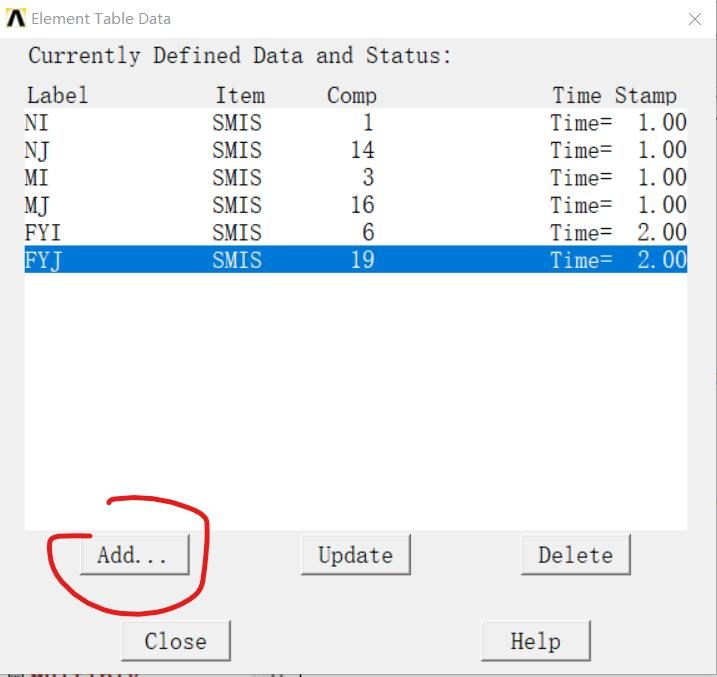
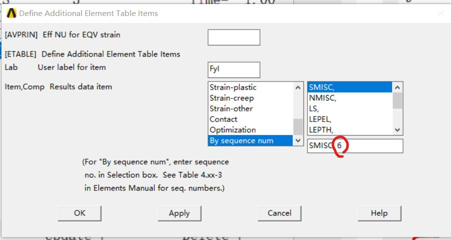
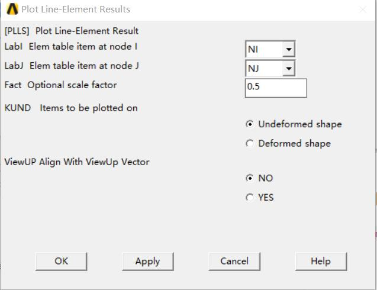

[首页](./readme.md) | [埋件](./埋件计算类.md) | [外挂](./外挂计算类.md) | [内爬钢梁](./内爬钢梁计算.md) | [附着](./附着计算.md) | [压杆](./压杆校核.md) | [风载](./风载.md)
# ANSYS画弯矩图、剪力图、轴力图(以BEAM188为例)

BEAM188单元输出数据项目和序列号

| 项目 | 命令  |  I   |  J   |
| :--: | :---: | :--: | :--: |
|  Fx  | SMISC |  1   |  14  |
|  My  | SMISC |  2   |  15  |
|  Mz  | SMISC |  3   |  16  |
| SFz  | SMISC |  5   |  18  |
| SFy  | SMISC |  6   |  19  |

## 设定Element Table

`General PostProc`-> `Elemnet table` -> `Define Table`

定义Lable, 然后从下面的选项框中选择By Sequence num ，右边选择SMISC，在下方输入对应的编号。

## Plot Element Table
在`General PostProc`->`Plot Result` -> `Contor Plot` -> `Line Element Res`中选择对应的I和J

