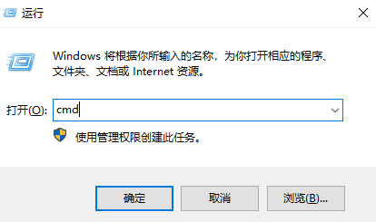
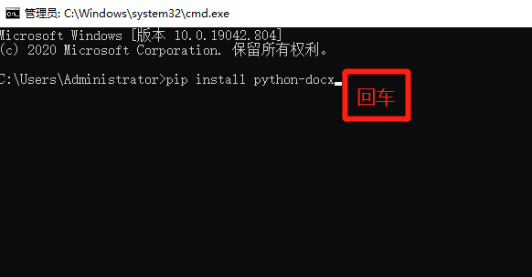

# ANSYS有限元分析+Python自动化

[埋件](埋件计算.md) | [内爬](内爬计算.md) | [底座梁](底座梁计算.md) | [附着](附着计算.md) | [压杆](压杆校核.md) | [风载](风载.md)

## 0. 使用环境

ANSYS宏文件是以.mac为后缀的文件，又称命令流文件。可在经典模式下使用，能够简化操作提高计算效率。

推荐使用ANSYS19或19.1版本，最低不能低于18，也不能使用更高版本，最新的版本中对link10单元不再支持，会影响某些宏命令。

Python自动化计算代码是以.py为后缀的文件，需下载到电脑，且安装相关的执行软件方能运行。**安装Python时注意要勾选相关选项**（暂时无法截图说明）。

* [Python3.8.8 下载](https://www.python.org/ftp/python/3.8.8/python-3.8.8-amd64.exe)
* [局域网下载Python](https://xuming.science/file/python.rar)

推荐安装使用Visual Studio Code代码编辑软件：

* [Visual Studio Code](https://code.visualstudio.com/)
* [局域网下载VScode](https://xuming.science/file/VS.rar)

### 0.1. Python修改pip源地址

1. 下载所需文件[pip.ini(右击链接另存为)](./docs/pip.ini)
2. 打开C盘当前用户的文件夹，例如`C:\Users\Administrator`
3. 在用户目录下新建名为`pip`的文件夹
4. 将第一步下载的文件移动到第三步新建的文件夹内，最终该文件的路径如前例所示为`C:\Users\Administrator\pip\pip.ini`

### 0.2. 常用python模块安装

python代码通常会调用一些第三方模块，需要提前安装才能正常运行代码。

安装方法如下：

1. 按<kbd>Win</kbd> + <kbd>R</kbd> 调出运行窗口，输入cmd，点击确定，调出命令控制行



2. 逐行复制粘贴以下代码到命令控制行，粘贴一行按下回车，逐行操作
```
pip install python-docx
pip install pandas
pip install Pillow
pip install matplotlib
```


## 1. 在线计算小工具

*（仅适用于公司内部网络）*

* [行走轮压计算](http://192.168.16.198/lunya.php)
* [动臂吊臂头部侧向等效载荷计算](http://192.168.16.198/pianbai.php)
* [塔机固定基础稳定及所需地耐力估算](http://192.168.16.198/jichu.php)

## 2. ANSYS常用技术

* [ANSYS画弯矩图、剪力图、轴力图](ANSYS画弯矩图、剪力图、轴力图.md)

* [ANSYS经典模式自定义工具栏](ANSYS经典模式自定义工具栏.md)

