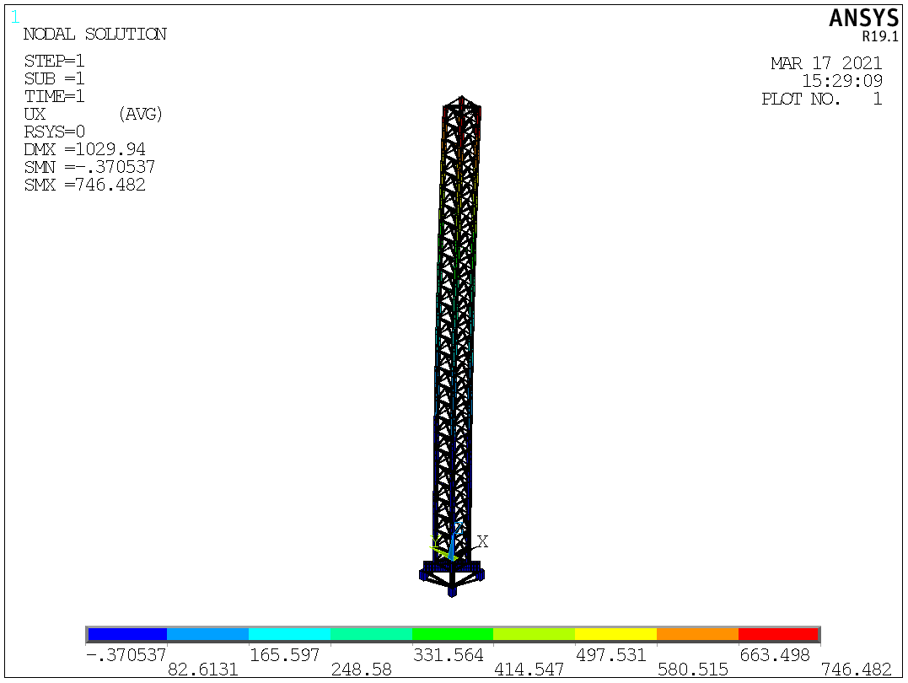
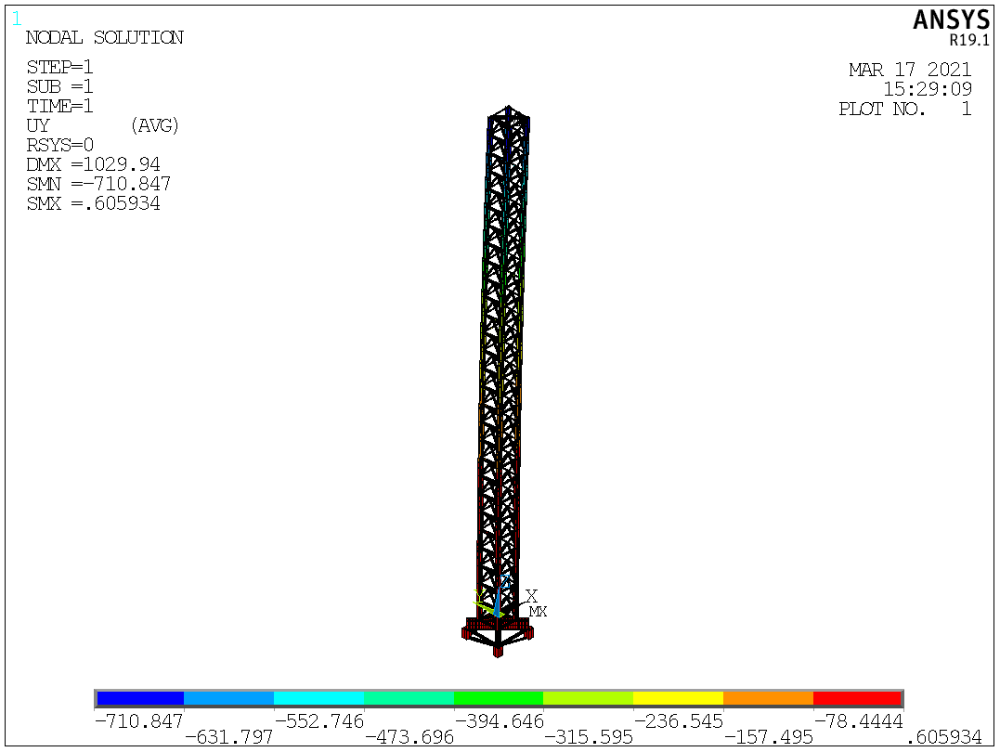
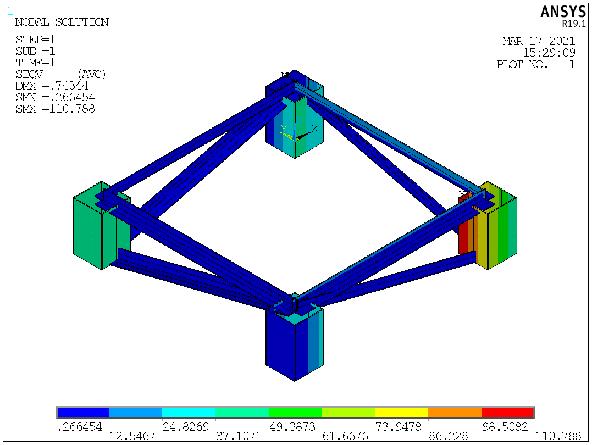
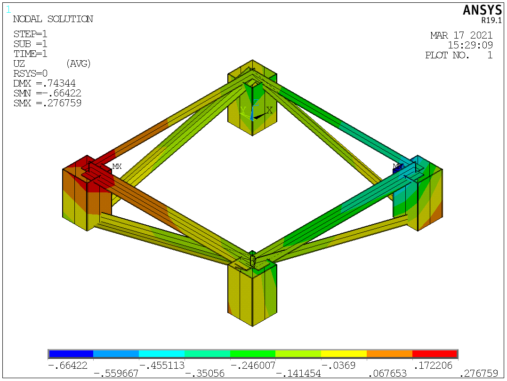
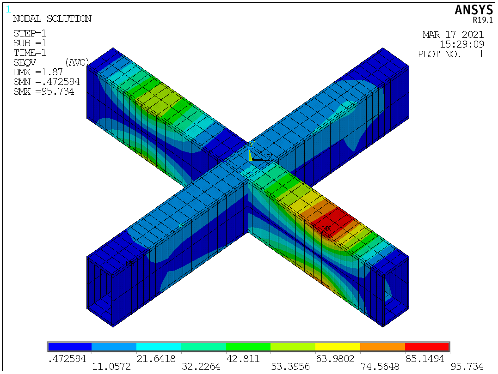
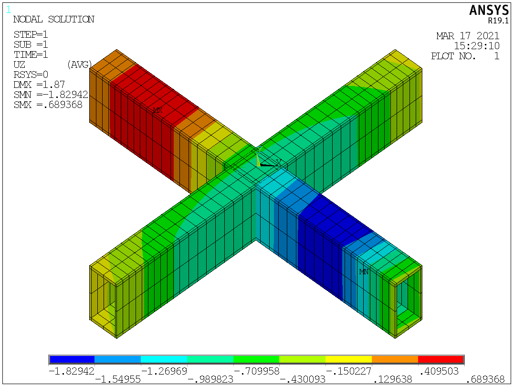

[首页](./readme.md) - [埋件](./埋件计算.md) - [内爬](./内爬计算.md) - [底座梁](./底座梁计算.md) - [附着](./附着计算.md) - [压杆](./压杆校核.md) - [风载](./风载.md) - [塔身](./塔身.md) - [吊臂](./吊臂.md) - [基础](./基础.md)

# 底座梁计算

## 1. 常用计算宏

[SZL01.mac](./macs/SZL01.mac)

使用格式：`SZL01,加载keypoint,垂直力,水平力,弯矩,约束node1,约束node2,约束node3,约束node4`

八种工况，自动汇总，加载和结果的单位t或t.m

保证模型上方为Z+

适用于十字梁反力计算

------

[DZL01.mac](./macs/DZL01.mac)

使用格式：`DZL01,加载keypoint,垂直力,水平力,弯矩,扭矩,约束node1,约束node2,约束node3,约束node4,杆单元编号1,杆单元编号2,杆单元编号3,杆单元编号4`

适用于底座梁、行走梁计算

------

## 2. 专用计算宏

[TSSZL.mac](./macs/TSSZL.mac)

塔身与底座十字梁加格构柱整体建模计算，提取格构柱底部反力，自动截图（整体X，Y位移，十字梁应力,Z向位移，格构柱应力,Z向位移）

需要定义：塔身主弦腹杆截面，十字梁截面，格构柱截面，塔身高度，格构柱高度，外载荷，格构柱中心距